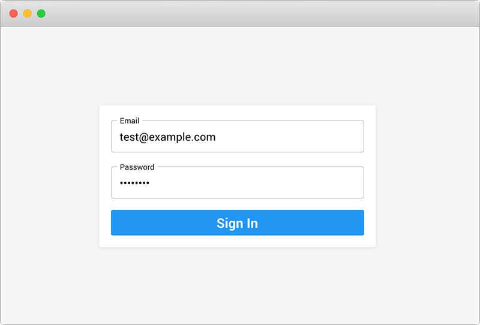

Node App
================

A starting point for node.js based apps. Uses Docker to setup a node.js, mysql, and redis server. Webpack is used to bundle the client JS.

[](https://i.imgur.com/YajROul.mp4)

<video>
<source src="https://i.imgur.com/YajROul.mp4" type="video/mp4">
</video>

## Getting Started on Development

### Prerequisite
You need [docker installed](https://docs.docker.com/compose/install/)

### 1.) Check the settings in `.env`
You should change the `SESSION_SECRET` and update the app and mysql ports if they are going to conflict with any of your existing services

### 2.) Start the app containers 
A node.js server, mysql database, and redis service will be started. The node server will auto restart after crashing or when changes are made to `/app/server`

```bash
$ cd /this/dir
$ docker-compose up
```

If all goes as planned, you should see this message:

```
App running: localhost:8080
```

> port may be different if you canged it in `.env`

### 3.) Start the developing
[Webpack](https://webpack.js.org/) will be used to watch the files in `/app/client` and rebuild them.

```bash
$ cd app
$ npm run dev
```

> The webpack bundler should be run from within the docker container.
> The `dev` script is setup to do that

## Commands
Some commands for developing

- `docker-compose up` - start the app
- `docker-compose down` - end the app
- `npm run dev` - watch for client changes and rebuild
- `npm run install` - install missing/new JS dependencies
- `npm run cd-server` - "change directory" to the node server

## Dependency notes
`jQuery` is imported by Backbone.js even though its not a hard dependency. Because of this, 
webpack complains if we dont have jQuery. To get around this, `client/jquery.js` was created
that only includes the absolute minimum

## Code Report
Keeping the client code slim and fast is important. An analyzer has been setup as part
of the initial webpack build so we can analyze what code oversized.

It can be accessed from the root: `localhost:8080/bundle-report.html`

